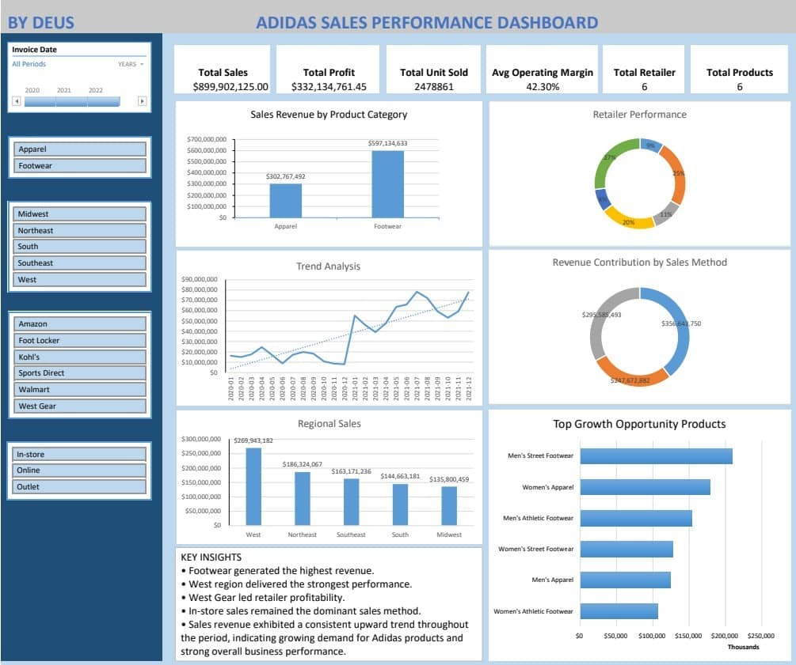

# 👟 Adidas Sales Performance Dashboard

> A data analytics capstone project analyzing Adidas sales performance across products, retailers, regions, and sales channels using Microsoft Excel.


📄 **Report:** [Strategic Recommendations Report](Report/Adidas_Sales_report.pdf)
---

## 📖 Project Overview

This capstone project analyzes **Adidas sales data** from **January 2020 to December 2021** across the United States. The goal was to transform raw transactional data into meaningful business insights that support strategic decision-making.

Using **Microsoft Excel**, I cleaned the dataset, built pivot tables, calculated KPIs, created interactive visualizations, and developed a dashboard that highlights sales performance across products, retailers, regions, and sales channels.

---

## 🎯 Objectives

- Measure overall sales and profitability performance during the period.
- Identify top-performing and underperforming product categories, regions, and sales channels.
- Compare sales contributions of major retail partners (Foot Locker, Walmart, Sports Direct).
- Assess the effectiveness of different sales methods (in-store vs. outlet vs. online).
- Provide actionable recommendations to optimize future sales campaigns and promotions.


---

## 📊 Dataset Information
**Dataset:** [Adidas Sales Data](Dataset/Adidas_dataset.xlsx)

The dataset contains Adidas sales transactions with the following attributes:

- Retailer
- Product
- Region
- Sales Method
- Units Sold
- Total Sales
- Operating Profit
- Operating Margin
- Date

**Analysis Period**

- January 2020 – December 2021

**Location**

- United States

---

## 🛠️ Tools Used

- Microsoft Excel
- Pivot Tables
- Pivot Charts
- KPI Cards
- Slicers
- Conditional Formatting
- Dashboard Design

---

## 📈 Dashboard Features

The interactive dashboard includes:

- ✅ Total Sales KPI
- ✅ Total Operating Profit
- ✅ Units Sold
- ✅ Average Operating Margin
- ✅ Sales Trend Analysis
- ✅ Product Performance
- ✅ Regional Performance
- ✅ Retailer Performance
- ✅ Sales Method Comparison
- ✅ Interactive Slicers

---

## 📌 Key Performance Indicators

| KPI | Value |
|------|-------:|
| Total Sales | **$899,902,125** |
| Operating Profit | **$332,134,761** |
| Units Sold | **2,477,861** |
| Average Operating Margin | **42.30%** |
| Retailers | **6** |
| Products | **6** |

---

## 🔍 Key Insights

### 👟 Product Category A nalysis


- Footwear generated the highest sales revenue.
- Footwear remains Adidas' strongest product category.

### 🌎 Regional Analysis


- The **West Region** recorded the highest sales.
- Some regions present opportunities for targeted marketing.

### 🤝 Retailer Performance


- **West Gear** was the highest-performing retailer.
- Retailer profitability varies significantly.

### 🛒 Sales Channels


- In-store sales generated the highest revenue.
- Online sales demonstrate strong growth potential.
- Outlet sales contributed the least revenue.

### 📈 Sales Trend


- Sales revenue showed a consistent upward trend throughout the analysis period, indicating increasing customer demand and sustained business growth.

---

## 💡 Business Recommendations

### Product Strategy

- Increase investment in footwear.
- Launch new footwear variants.
- Promote underperforming product categories.

### Channel Optimization

- Expand online sales.
- Improve e-commerce experience.
- Optimize outlet pricing strategies.

### Regional Focus

- Continue investing in the West region.
- Develop marketing campaigns for lower-performing regions.
- Tailor products to regional preferences.

### Demand Forecasting

- Use historical sales data for inventory planning.
- Predict seasonal demand.
- Reduce stock shortages and overstocking.

### Retail Partner Management

- Strengthen partnerships with top-performing retailers.
- Improve collaboration with lower-performing partners.
- Use retailer performance metrics for strategic decisions.

---

## 📁 Repository Structure

```
Adidas-Sales-Analysis/
│
├── Dataset/
│   └── Adidas_dataset.xlsx
│
├── Dashboard/
│   └── Adidas_Sales.xlsx
│
├── Images/
│   ├── dashboard.png
│
├── Report/
│   └── Adidas_Sales_report.pdf
│
└── README.md
```

---

## 📷 Dashboard Preview

> *
*
- Live Demo(https://1drv.ms/x/c/5E766A4F9499C1F2/AZL455UFJhRAvHRj5UwFeOg?e=DJMv2k)



---

## 🚀 Project Outcomes

✔ Built an interactive Excel dashboard

✔ Performed exploratory data analysis

✔ Generated business insights

✔ Created executive-level KPIs

✔ Developed strategic recommendations

---

## 📚 Skills Demonstrated

- Data Cleaning
- Data Analysis
- Data Visualization
- Dashboard Development
- KPI Design
- Pivot Tables
- Business Intelligence
- Business Reporting
- Strategic Analysis
- Excel Analytics

---

## 👨‍💻 Author

**Deus Masanja**

Aspiring Data Analyst passionate about transforming raw data into actionable business insights.

**GitHub**

https://github.com/darus045

---

## ⭐ If you found this project useful, consider giving it a star!
